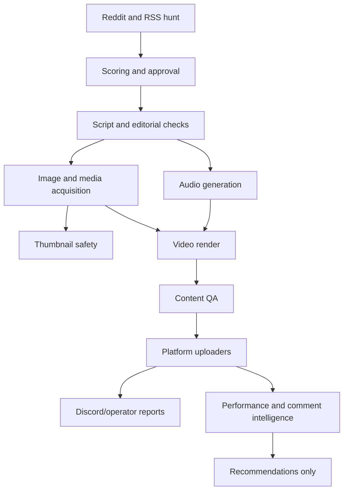

# Pulse System Map

## High-Level Flow

## Key Areas

- `run.js`: operator entrypoint for hunt, produce, publish and schedule.
- `server.js`: dashboard API and scheduler exposure.
- `publisher.js`: publish orchestration and platform safety fields.
- `upload_youtube.js`: YouTube upload and thumbnail QA integration.
- `upload_facebook.js`: Facebook Reel/Card upload logic.
- `upload_instagram.js`: Instagram Reel/Story upload logic.
- `upload_tiktok.js`: official TikTok API path.
- `lib/studio/v2/*`: Studio V2 render architecture, cards, QA and reports.
- `lib/thumbnail-safety.js`: rejects unsafe portrait/avatar/author imagery.
- `lib/thumbnail-candidate.js`: creates safe branded thumbnail candidates.
- `lib/media-inventory.js`: grades whether a story has enough visual source material.
- `lib/ops/*`: local read-only operational diagnostics.
- `lib/platforms/tiktok-dispatch.js`: manual TikTok dispatch packs.
- `lib/performance/*`: analytics learning skeleton.
- `lib/comments/*`: comment classification and draft-only reply queue.

## Current Default Decisions

- YouTube remains the core platform.
- Canonical Studio V2 remains the default premium render.
- TikTok is handled by dispatch packs until public posting is unblocked.
- Analytics and comment intelligence are advisory only.
- Thin-visual stories should be downgraded rather than forced into premium video.

