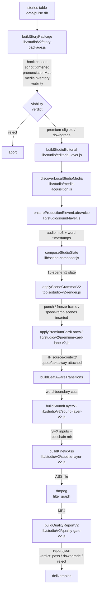

# Studio Short Engine v2 — architecture

This document maps every module in the v2 engine, what it owns, and how data flows from a story row in the DB to a finished MP4.

## Pipeline (high level)



## Modules

### Story package (`lib/studio/v2/story-package.js`)

Reads the DB row plus the local cache. Emits a `<id>_studio_v2_package.json` artifact containing:

- **hook**: chosen variant + 10 candidates, generated by Anthropic Claude (`claude-haiku-4-5-20251001`) when `ANTHROPIC_API_KEY` is set, else a 10-template offline fallback. Auto-picks the first variant in the 8-12 word band with no AI tells.
- **script.tightened**: the spoken-word script after stripping filler phrases ("but here's where it gets interesting", "let that sink in", etc.)
- **pronunciationMap**: list of `{ written, spoken, kind }` for every year (`2024 → twenty twenty-four`), acronym + number (`GTA 6 → G T A six`), and money (`$5B → 5 billion`) found in the script. Used by the TTS preprocessor.
- **mediaInventory**: trailerClips, trailerFrames, articleHeroes, articleInline, stockFiller — paths discovered from `output/video_cache/` and `output/image_cache/`.
- **sourceMix**: diversity score 0-100 weighted on clip vs frame vs hero presence.
- **candidateScenes**: types the slate could carry given what's available.
- **quoteCandidates / statCandidates**: pulled from `top_comment` and any Steam metadata.
- **riskFlags**: `no-trailer-clips`, `thin-still-set`, `stock-only`, `hook-word-count`, `ai-tell-in-hook`, `no-pronunciation-map`.
- **viability**: 0-100 score plus verdict (`premium-eligible` / `downgrade` / `reject`). Reject aborts before any rendering.

### Editorial (`lib/studio/editorial-layer.js`)

Reused from v1. Tightens the script, removes generic CTAs (`follow pulse gaming so you never miss a beat.`), ensures the 12-word hook cap, and produces the spoken-form script for TTS by normalising digit pronunciations.

### Media acquisition (`lib/studio/media-acquisition.js`)

Reused from v1. Discovers cached trailers/frames/heroes, slices trailer clips into A/B/C 5-second chunks, extracts evenly-spaced frames if missing, ranks source diversity. v2 doesn't extend this layer — the existing one is sufficient.

### Voice path (`lib/studio/sound-layer.js`)

Reused from v1. ElevenLabs production path is the default — uses voice ID Liam (`TX3LPaxmHKxFdv7VOQHJ`), `eleven_multilingual_v2`, dynamic per-segment pacing (hook 1.05x, body 0.95x, loop 1.0x of base rate), with-timestamps endpoint for forced alignment. Caches by signature hash so re-runs reuse audio when nothing changed.

### Scene composer (`lib/scene-composer.js`)

Reused from v1. Builds a 12-16 scene slate: opener, source card, alternating clips/frames/heroes, quote card near 50%, release/known-unknown card near 75%, takeaway card last. Anti-repetition pass prevents `>2` of any still source and bans adjacent same-type cards.

### Scene grammar v2 (`lib/studio/v2/scene-grammar-v2.js`)

Three new scene types:

- **`punch`**: 1.4-2.0s sub-slice from a trailer clip via `-ss` + `-t` input flags. Renders as `scale + crop + fps + trim`.
- **`speed-ramp`**: piecewise `setpts` envelope, slow-in (2.0 → 1.0) or fast-out (1.0 → 2.0), no audio (clips are already muted at the audio mix).
- **`freeze-frame`**: clip plays for `playInS` seconds then `tpad=stop_mode=clone` holds the last frame. Caption beat with fade-in and amber accent line. **Adds `-loop 1` automatically when source is a still image** — without this the input clamps to one frame and the slate loses ~4 seconds.

`planPunchSlicesFromClip` splits a long trailer into N evenly-spaced punches at deterministic offsets.

### V2 grammar transformer (in `tools/studio-v2-render.js`)

`applySceneGrammarV2({ scenes, story, mediaClips })`:

1. Walks the v1 slate, finds CLIP and clip-backed-OPENER scenes.
2. Picks the **two least-used clip sources** in the slate (preferring unused clips) and inserts them as a 2-punch pair at the middle clip slot. Repeats for a second pair if 3+ clips are available, picking distinct sources from the first pair.
3. Inserts one freeze-frame at ~70% with a story-derived caption (`SEVEN YEARS QUIET` for Metro, etc.).
4. Optional speed-ramp slow-in at the slot just before takeaway, IFF that slot is a real video CLIP (not a still — still inputs would break the `setpts` envelope).

### Premium card lane v2 (`lib/studio/v2/premium-card-lane-v2.js`)

Routes 4 card types onto the HyperFrames lane:

- `card.source` → `hf_source_card_<id>.mp4` (per-story) ‖ `hf_source_card_v1.mp4` (generic)
- `card.stat` → `hf_context_card_<id>.mp4` ‖ `hf_context_card_v1.mp4`
- `card.quote` → `hf_quote_card_<id>.mp4` ‖ `hf_quote_card_v1.mp4`
- `card.takeaway` → `hf_takeaway_card_<id>.mp4` ‖ `hf_takeaway_card_v1.mp4`

Per-story renders are produced by `tools/studio-v2-build-cards.js` which content-derives every card from the story package. Lane verdict: `pass` (≥3 HF cards), `partial` (2), `thin` (≤1).

### HF card builders (`lib/studio/v2/hf-card-builders.js`)

Four content-aware builders. Each:

1. Copies the template HF project from `experiments/hf-<kind>/` to `experiments/hf-<kind>-<storyId>/`.
2. Reads the template `index.html`, swaps in story-specific text via deterministic regex replacements (no DOM parsing needed for these compositions).
3. Auto-scales the headline font size by character count.
4. Writes the per-story `index.html`, lints with `npx hyperframes lint`, renders to MP4 with `npx hyperframes render`.

`deriveCardContent({ story, pkg })` is the heuristic layer:

- **Source**: subreddit / source_type / flair.
- **Context**: smart year-gap extraction. Filters out future / in-game years above `currentYear + 1`. With 2+ release years, picks the largest valid gap. With 1 release year, computes `currentYear - releaseYear`. Falls through to dollar / percent / `BACKGROUND`.
- **Quote**: trims `top_comment` to the first short sentence (≤90 chars). Attribution from subreddit.
- **Takeaway**: title and flair keywords drive between `WATCH THE FULL TRAILER`, `MARK THE DATE`, `WAIT FOR CONFIRMATION`, `FOLLOW FOR MORE`.

### Sound layer v2 (`lib/studio/v2/sound-layer-v2.js`)

- Voice splits via `asplit=2` so one stream feeds the final mix and the other becomes the sidechain trigger.
- Music bed at `volume=0.18` then `sidechaincompress=threshold=0.05:ratio=4:attack=5:release=250:knee=2:level_sc=1`.
- SFX cues: opener sting at t=0, optional whooshes on every cut transition (gated by `STUDIO_V2_SFX_MODE` env, default `minimal` = opener only).
- Final `amix=inputs=3:duration=first:dropout_transition=0:normalize=0` → `[outa]`.

EBU R128 measurements ([STUDIO_V2_AUDIO_ANALYSIS.md](STUDIO_V2_AUDIO_ANALYSIS.md)): -24.2 LUFS integrated, -3.9 dBFS true peak. +12.1 LU louder than v1.

### Subtitle layer v2 (`lib/studio/v2/subtitle-layer-v2.js`)

Kinetic per-word ASS:

- **Realignment**: maps script tokens to TTS alignment, special-cases year expansion (`2039` ⇄ `twenty 39`) which ElevenLabs splits into a numeric token. Safety reset triggers after 8 consecutive mismatches → returns the original alignment unchanged.
- **Phrase grouping**: 4 words per phrase, breaks on `.!?`.
- **Per-word pop**: each word emitted as a single Dialogue with inline `\t()` transforms — pops 85% → 115% → 100% scale over 220ms, alpha fades from 0 → 100% over 30ms.
- **Emphasis**: years (`\d{4}`), money (`\$\d+`), percentages, all-caps tokens, story-derived proper nouns get the `PopEmphasis` style (100pt amber 0xFF6B1A vs 88pt white).

### Beat-aware transitions (in `tools/studio-v2-render.js`)

`buildBeatAwareTransitions(scenes, words)` walks the realigned word timestamps. For every cut at position `runningDur`, snap to the nearest word-end within ±0.20s. Records ratio of cuts aligned within 0.15s — quality gate grades green at ≥0.60.

### Quality gate v2 (`lib/studio/v2/quality-gate-v2.js`)

Codex's modified file owns this layer. Graders cover:

- hookWordCount, hookAiTells
- spokenWPM (target 130-160)
- sourceDiversity, clipDominance, sceneVariety, maxStillRepeat
- captionGapsOver2s
- **durationIntegrity** — render duration vs narration / last subtitle cue (added by Codex)
- adjacentSameTypeCards, stockFillerCount
- voicePathUsed
- motionDensityPerMin, beatAwarenessRatio
- sfxEventCount, bedDuckingDb

Verdict: `pass` (no reds), `downgrade` (red trips), `reject` (clip dominance + still repeat both red, OR stock filler red, OR <50% green).

## Test surface

`tools/studio-v2-test-harness.js` runs 30 tests against the engine without rendering:

- 8 tests on story package (pronunciation map, hook variants)
- 9 tests on card content derivation (year gap, money, percent, takeaway routing)
- 4 tests on cross-clip punch picker permutations
- 9 tests on subtitle realignment (clean, year expansion, corruption safety reset, empty input, ASS build)

`node tools/studio-v2-test-harness.js` — runs the full suite, exits non-zero on any failure.

## Outputs

```
test/output/
├── studio_v2_<id>.mp4              — canonical render
├── studio_v1_vs_v2_<id>.mp4        — side-by-side comparison
├── studio_v1_<id>_contact.jpg      — v1 frame grid
├── studio_v2_<id>_contact.jpg      — v2 frame grid
├── studio_v2_<id>_audio_waveform.png — v2 audio waveform
├── studio_v1_v2_audio_compare.png  — waveform A/B
├── studio_v2_opener_ab_compare.jpg — opener A/B
├── studio_v2_deliverables.html     — browsable bundle
├── <id>_studio_v2_package.json     — story package
├── <id>_studio_v2_report.json      — quality gate report
├── <id>_studio_v2_cards.json       — per-story card manifest
├── studio_v2_test_harness_report.json — test harness pass/fail summary
├── hf_source_card_<id>.mp4         — per-story HF source
├── hf_context_card_<id>.mp4        — per-story HF context
├── hf_quote_card_<id>.mp4          — per-story HF quote
├── hf_takeaway_card_<id>.mp4       — per-story HF takeaway
├── hf_opener_card_v1.mp4           — generic HF opener (A/B candidate)
└── 1sn9xhe_studio_v2.ass           — kinetic word-pop subtitle file
```

Source code lives under:

```
lib/studio/v2/                       — the engine
├── story-package.js
├── scene-grammar-v2.js
├── sound-layer-v2.js
├── subtitle-layer-v2.js
├── premium-card-lane-v2.js
├── hf-card-builders.js
└── quality-gate-v2.js

experiments/                         — HyperFrames templates + per-story projects
├── hf-source/                       — generic
├── hf-source-<id>/                  — per-story
├── hf-context/
├── hf-context-<id>/
├── hf-quote/
├── hf-quote-<id>/
├── hf-takeaway/
├── hf-takeaway-<id>/
└── hf-opener/                       — opener A/B candidate

tools/                                — orchestration + diagnostics
├── studio-v2-render.js              — main orchestrator
├── studio-v2-build-cards.js         — build all 4 per-story cards in one pass
├── studio-v2-build-quote-card.js    — manual quote card override
├── studio-v2-compare.js             — side-by-side MP4 builder
├── studio-v2-contact-sheet.js       — frame-grid JPEG builder
├── studio-v2-deliverables-page.js   — browsable HTML bundle
└── studio-v2-test-harness.js        — engine robustness tests
```
