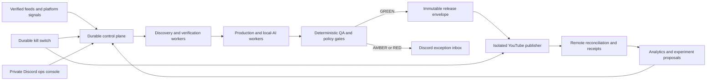

# Pulse Gaming GREEN Autopilot Design

**Date:** 14 August 2026

**Status:** Approved design; not yet armed for live operation

**Initial scope:** Pulse Gaming, YouTube Shorts, one Windows production host

**Primary objective:** Operate a continuous, local-first content conveyor with standing authority to publish strict-GREEN releases and negligible routine operator input.

## 1. Decision summary

Pulse Gaming will use a durable local control plane with isolated worker lanes. Local AI may research within supplied evidence, draft, critique and suggest repairs. Deterministic controls remain authoritative for source verification, rights, factual support, technical QA, policy and publication eligibility.

The system itself will hold standing publication authority for releases that satisfy the fixed `AUTONOMOUS_GREEN` contract. An individual model response cannot grant, widen or override that authority. Design approval does not activate the authority: a separately recorded operator signature is required after the acceptance evidence is complete.

Phase 1 is deliberately limited to YouTube Shorts:

- one public Short per day after the canary phase
- two per day only after 30 clean, duplicate-free public days
- no rumour-led autonomous publication
- no editorial copyright exception in the autonomous lane
- no AMBER or RED autonomous publication
- Discord as the private operator console and exception inbox
- cloud AI disabled by default

## 2. Context

The repository already contains much of the required substrate:

- durable SQLite jobs, leases, retries and idempotency
- scheduled discovery, production, watchdog, analytics and learning handlers
- a guarded YouTube publication path with immutable evidence and reconciliation
- local Ollama routing with Gemma 4B and 12B
- local VoxCPM narration
- local Whisper-compatible transcription and word alignment
- HyperFrames, FFmpeg and Sharp media production
- Discord webhook and bot configuration
- policy, rights, technical QA and control-tower concepts

The current environment is not ready to arm. The design audit found no active production scheduler or workers, an expired scheduler lease, disabled production and publication schedules, no current publish candidates and split or dirty runtime identities. Existing Discord inbound approval paths are also unsuitable for authoritative decisions.

The V15 Half-Life 2 RTX Short proves the desired quality and guarded publication mechanics. It does not yet prove repeatable autonomous production.

## 3. Goals

1. Discover, verify, produce, QA and publish routine YouTube Shorts without per-video approval.
2. Use locally installed AI for routine creative work and operator assistance.
3. Keep every external mutation fail-closed, idempotent and auditable.
4. Ask the operator only about genuine exceptions, incidents and strategy.
5. Recover safely after process, host, network and platform failures.
6. Improve performance through measured experiments without allowing models to weaken safety gates.
7. Make current operational state clear through durable evidence rather than process-presence heuristics.

## 4. Non-goals

- Autonomous TikTok, Instagram, Facebook or X publication during Phase 1.
- Autonomous publication of AMBER or RED releases.
- Allowing an LLM to approve rights, invent sources or grant publication authority.
- Automatically changing policy thresholds, prompts or models based only on analytics.
- Reusing legacy `run.js full`, `run.js publish` or broad `upload_*.js` live paths as the production conveyor.
- Running multiple production owners against the same database or publication ledger.
- Guaranteeing that no platform claim or policy change will ever occur. The design detects, contains and escalates those events.
- Treating approval of this design document as permission for a live upload, visibility change or schedule activation.

## 5. Operating contract

### 5.1 Standing authority

`AUTONOMOUS_GREEN` is a versioned, machine-readable standing authority bound to:

- channel: `pulse-gaming`
- platform: YouTube Shorts
- an immutable production commit and approved configuration set
- approved local model identities
- approved source classes and rights tiers
- fixed technical, factual, originality, policy and publication gates
- maximum daily cadence and permitted windows
- a healthy durable kill switch
- an exact publication worker identity

The authority is created inactive. It becomes active only after an operator-signed arming decision binds the acceptance report, exact production commit, configuration, platform account, cadence and effective policy. The private-canary promotion and first public-ramp promotion each require their own operator-signed decision. After public arming, routine qualifying GREEN releases require no per-video approval.

The authority is suspended automatically when any binding changes or a required health check fails. Re-authorisation requires the change to pass the shadow acceptance suite and receive a fresh operator-signed arming decision.

### 5.2 Autonomous eligibility

A release may publish autonomously only when all of the following are true:

- the story comes from a verified source class
- factual claims map to retained source evidence
- the story is timely, non-duplicate and on-brand
- every media placement has a canonical identity and permitted use
- the release uses original, licensed or policy-GREEN media only
- no rumour or unresolved factual ambiguity remains
- script, narration, captions and visible copy agree
- visual, audio, temporal, caption and container QA are GREEN
- originality and monetisation checks are GREEN
- YouTube metadata and disclosure requirements are GREEN
- the immutable release envelope is fresh and hash-complete
- cadence, cooldown, daily cap, kill switch and circuit breakers are clear
- the control tower returns canonical GREEN

### 5.3 Holds and exceptions

- AMBER items enter the Discord exception queue.
- RED items are not approvable and must be repaired or rejected.
- A human may approve a one-off, hash-bound AMBER exception through a separate manual authority contract. That action never widens autonomous standing authority.
- Any changed byte invalidates a prior decision tied to that release envelope.

## 6. System architecture

### 6.1 Protected production runtime

Production runs from one immutable `pulse-gaming-live` checkout. Development occurs in a separate checkout. Mutable data lives outside the source tree under a production data root, with explicit directories for SQLite, media, evidence, receipts, logs and backups.

Only the approved production commit may own the live scheduler lease. Startup fails rather than continuing in a partially initialised state.

### 6.2 Control plane

The control plane owns:

- SQLite and migrations
- schedule definitions
- enqueueing and idempotency keys
- worker leases and heartbeats
- standing authority state
- kill-switch state
- circuit breakers
- operator decision ledger
- notification outbox
- publication and reconciliation ledgers

It never renders media or calls a platform mutation API.

### 6.3 Worker lanes

Workers are separated by capability:

1. **Discovery and verification:** feeds, canonicalisation, deduplication, claim extraction and source confidence.
2. **Editorial:** angle selection, script drafting, critique and source-bound rewriting.
3. **Media and narration:** rights-backed acquisition, narration, timestamps, captions, images and motion.
4. **Render and QA:** composition, encoding, visual/audio/temporal inspection and evidence packaging.
5. **Repair:** bounded internal repairs that never publish.
6. **Analytics and learning:** performance collection and experiment proposals.
7. **Publish-critical:** YouTube-only, credential-bearing and unable to hunt, write scripts, render or repair.

Each job has one durable owner lease, bounded retry policy and an idempotency key derived from operation, story, artefact hash and policy version.

### 6.4 Publish-critical boundary

The publisher accepts only an immutable GREEN release envelope. Immediately before a mutation it revalidates:

- standing authority
- source and output hashes
- policy and code identity
- target channel and platform
- freshness
- publish window and daily cap
- duplicate and cooldown state
- kill switch
- circuit breakers
- absence of an existing mutation reservation

The worker writes a durable attempt sentinel before any network mutation. Unknown outcomes are reconciled remotely and are never blindly retried.

YouTube credentials are available only to this worker. The publish-critical service runs under a dedicated least-privileged Windows service account. Its OAuth material is stored through a DPAPI or Windows Credential Manager boundary, or in an ACL-protected directory readable only by that account. Content, render, analytics and repair worker identities cannot read it.

The control plane and publisher communicate through an authenticated local release queue. Only the authority broker can sign a publication request. The publisher validates that signature, the complete envelope and current remote intent before using a credential. Workers cannot mint a request by writing arbitrary queue rows or files.

## 7. Content state model

The canonical happy path is:

`DISCOVERED -> VERIFIED -> SELECTED -> SCRIPTED -> MEDIA_BOUND -> RENDERED -> QA_GREEN -> ENVELOPED -> PUBLISH_RESERVED -> UPLOADED -> RECONCILED -> MEASURED`

Exceptional states are explicit:

- `DEFERRED_STALE`
- `DUPLICATE`
- `AMBER_REVIEW`
- `RED_REPAIR`
- `REJECTED`
- `AUTHORITY_SUSPENDED`
- `MUTATION_OUTCOME_UNKNOWN`
- `RECONCILIATION_REQUIRED`
- `CLAIM_OR_RESTRICTION_HOLD`

State changes use expected-version checks. Jobs and operator decisions cannot silently overwrite newer state.

## 8. Local AI design

### 8.1 Routing

- **Gemma 4B:** extraction, summaries, entity detection, title variants, clustering, analytics prose and concise operator questions.
- **Gemma 12B:** script drafting, source-bound editorial review, rewrites and creative critique.
- **VoxCPM:** narration using the approved local voice reference.
- **faster-whisper:** transcript and word-timestamp verification.
- **Sharp, HyperFrames and FFmpeg:** deterministic media processing and rendering.

The installed 27B models are not part of the normal production route because they compete with resident narration workloads for the 24 GB GPU. They may be evaluated offline in shadow experiments.

### 8.2 Shared GPU queue

One durable GPU queue serialises Ollama, narration, ASR and render-heavy stages. Jobs declare estimated memory class, timeout and cancellation behaviour. The queue verifies actual service health rather than treating configuration as readiness.

### 8.3 Failure and escalation

- A local model schema or quality failure receives one bounded repair attempt.
- Repeated failure holds or reroutes the internal job. It does not weaken validation.
- Cloud AI is disabled by default.
- Any future cloud escalation requires a separately approved provider, task allow-list, cost ceiling and audit receipt.
- A model or prompt change is treated as production configuration drift and must pass shadow validation before promotion.

### 8.4 Authority boundary

AI outputs are proposals. Deterministic code and retained evidence decide:

- source verification
- factual support
- rights and placement completeness
- originality
- technical quality
- platform policy
- standing authority
- publication eligibility

## 9. Discord operator console

### 9.1 Existing integration

The configured webhook and bot are reused for transport. Existing inbound approval handlers are not reused as authority because they lack an exact operator allow-list and can mutate legacy story files.

### 9.2 Private operations channel

A dedicated private `discord-ops` channel is served by an operations bot separate from public community behaviour. Commands are accepted only when all of these match fixed configuration:

- Discord guild ID
- private channel ID
- exact operator user ID
- expected interaction type

Roles may add defence in depth but cannot replace the user-ID check.

### 9.3 Outbound messages

The system sends:

- immediate P0/P1 incidents
- claims, restrictions and credential warnings
- authority and kill-switch changes
- daily operational digest
- weekly strategy and performance digest
- publication and reconciliation receipts
- compact AMBER/RED exception cards

A durable outbox stores unique event keys, attempts, backoff, Discord message IDs and dead-letter state. Existing incident messages are edited as state changes to avoid duplicate noise.

### 9.4 Inbound commands

The initial command set is intentionally narrow:

- `/pulse status`
- `/pulse why-blocked`
- `/pulse pause`
- `/pulse kill`
- `/pulse resume`
- `/pulse hold`
- `/pulse reject`
- `/pulse revise`
- `/pulse ask`

`pause` and `kill` are immediate fail-safe actions. `resume` requires a confirmation interaction plus a fresh control-plane health check. Natural-language answers from `/pulse ask` are advisory.

An operator decision binds actor, guild, channel, interaction ID, target, exact artefact hash, expected state version, nonce, expiry, prior state, result and timestamps. Discord handlers enqueue canonical control-plane commands and never call publishers directly.

Community messages remain advisory and cannot pause the system, trigger repair work or change publication state.

## 10. Reliability and failure handling

| Failure class | Required behaviour |
| --- | --- |
| Local AI unavailable | Hold affected internal jobs, keep control plane healthy and alert after threshold |
| Narration or ASR unavailable | Hold media stage, restart through supervisor and never substitute an unapproved cloud path |
| Worker crash | Lease expires, bounded safe retry occurs and duplicate work is suppressed |
| Scheduler bootstrap failure | Production process exits unhealthy; readiness stays false |
| Database unavailable or corrupt | Stop enqueueing and publishing, preserve evidence and alert immediately |
| Render or QA failure | Route to bounded repair or RED hold; never publish |
| Discord unavailable | Continue safe GREEN operation, queue notifications and expose dashboard status |
| YouTube preflight failure | Do not mutate remotely; open incident |
| Ambiguous YouTube mutation | Mark reconciliation required and perform no second insert or update |
| Claim, strike or restriction | Suspend publication authority and alert immediately |
| Configuration or commit drift | Suspend standing authority until revalidated |
| Kill switch active | Block every external mutation across restarts |

Platform circuit breakers are durable rather than process-memory state. Publisher leases renew during long operations. All critical writes use transactional or atomic semantics.

## 11. Readiness and observability

The production readiness endpoint returns GREEN only when all required conditions are live:

- approved commit and configuration
- current database migrations
- valid scheduler lease
- fresh heartbeats for required worker classes
- healthy SQLite integrity and queue state
- healthy Ollama, narration and ASR probes
- healthy kill switch
- standing authority active
- publication worker isolated and idle or healthy
- expected schedules reconciled and enabled
- no unresolved P0/P1 incident
- fresh backup and successful restore-drill evidence within policy

Process existence alone is never treated as readiness.

Operational metrics include queue age, stage latency, retries, held reasons, GPU utilisation, release conversion, false-green count, duplicate count, off-schedule count, reconciliation latency, claims, retention and subscriber conversion.

## 12. Deployment and supervision

One SYSTEM-at-startup Windows supervisor owns:

- control-plane API and scheduler owner
- content workers
- media, render and repair workers
- publish-critical worker
- analytics worker
- Ollama
- VoxCPM
- required local inference services

The supervisor coordinates service lifecycle but does not inject one shared SYSTEM token into every process. Windows Service Control Manager or equivalently isolated scheduled services launch each lane under its assigned identity. The publisher uses the dedicated credential-bearing identity described in section 6.4. Other workers use identities with no access to platform credentials or the authority signing key.

Each child has a readiness probe, restart budget and durable incident state. Repeated failure opens a circuit breaker rather than entering an endless restart loop.

The development checkout cannot acquire production leases or access publication credentials.

## 13. Cutover plan

### Phase 0: Runtime reconstruction

- choose and freeze one production commit
- separate live and development checkouts
- classify or remove runtime drift
- reconcile SQLite migrations, schedules and stale jobs
- disable legacy live entry points
- establish backups and a verified restore path
- amend `docs/codex-main-goal.md` and the effective operating contract so the recorded `AUTONOMOUS_GREEN` standing-authority review explicitly supersedes per-story review for eligible strict-GREEN releases only
- keep all existing live paths fail-closed until that amendment and its tests are accepted

Before shadow operation, close and evidence the repository-declared production input gaps:

- final narration audio exists and matches the approved voice path
- word timestamps and caption mappings are complete
- materialised motion clips exist
- distinct motion-family requirements pass
- every final MP4 identity and QA report is fresh
- all media placements have complete canonical rights records
- scheduler bridge and strict dry-run evidence are current and GREEN
- no legacy thin-render, placeholder-title or internal-QA-copy incident remains in a candidate

### Phase 1: Hardening

- implement truthful readiness
- unify durable kill-switch semantics
- add publisher lease heartbeat
- persist platform circuit breakers
- add the shared GPU queue and real local-service probes
- implement the immutable GREEN standing-authority contract
- implement isolated publication envelopes
- implement the secure Discord ops console and durable outbox

### Phase 2: Shadow acceptance

Run for 7–14 days without public mutations and require:

- at least 30 representative stories processed through preflight
- at least 10 consecutive strict-GREEN release envelopes
- zero false-green decisions
- zero duplicates
- zero off-schedule actions
- successful host restart, worker restart, database restore, kill-switch and ambiguous-mutation drills
- operator-readable daily and weekly Discord digests

### Phase 3: Private canary

After an operator-signed private-canary promotion, upload 5–10 GREEN candidates privately. Verify exact video identity, metadata, captions, disclosures, processing, claims visibility where available and duplicate protection. Every canary must have a complete remote reconciliation receipt.

### Phase 4: Public ramp

- require an operator-signed public-ramp arming decision bound to the completed canary report
- publish at most one strict-GREEN Short per day
- suspend automatically on any authority, rights, claim, duplicate, QA or reconciliation incident
- remain at one daily until 30 clean public days and all recovery drills remain current
- increase to two daily only after an explicit cadence promotion artefact

## 14. Continuous optimisation

Analytics may propose:

- hook variants
- title and packaging variants
- publish-window changes
- pacing and duration changes
- content-pillar allocation
- new repeatable formats

Every change is versioned and evaluated in shadow or controlled A/B mode. Promotion requires predetermined sample size, quality floors and no safety regression. Analytics cannot directly change policy gates, rights tiers, publication authority or the kill switch.

## 15. Operator experience

Normal operator involvement should be:

- a brief daily digest requiring no response when healthy
- a weekly strategy digest with a small number of recommended experiments
- immediate questions only for rights or legal ambiguity, new source and format approval, credential re-authentication, claims or strikes, corrections, takedowns and significant incidents

Routine GREEN publication does not require approval. The operator can pause or kill the conveyor from Discord at any time.

## 16. Testing strategy

Implementation follows test-driven development. Required test layers are:

1. Pure unit tests for eligibility, state transitions, authority, kill switch and command validation.
2. Repository tests for leases, idempotency, outbox, decisions and publication ledgers.
3. Worker integration tests with injected local-AI, media and platform boundaries.
4. Mutation-boundary tests proving one remote action at most and permanent no-retry after ambiguity.
5. Security tests for Discord actor, guild and channel allow-lists plus replay and expiry.
6. Restart and crash tests around every reservation and receipt boundary.
7. End-to-end shadow fixtures for GREEN, AMBER, RED, stale, duplicate and platform-failure cases.
8. Private YouTube canaries with independent readback.
9. Production drills for kill switch, restoration, reconciliation and authority revocation.

No gate may be weakened merely to make a fixture pass.

## 17. Definition of operational completion

The conveyor is considered fully armed only when:

- one immutable production runtime is supervised and healthy
- required schedules and workers have fresh leases and heartbeats
- local AI, narration and ASR pass real health probes
- the 30-story and 10-consecutive-GREEN acceptance thresholds pass
- private canaries pass exact remote reconciliation
- kill-switch, restart, restore and ambiguous-outcome drills pass
- Discord two-way operations and durable notifications pass
- the control tower grants `AUTONOMOUS_GREEN`
- the operator-signed `AUTONOMOUS_GREEN` arming decision is current and exact
- the scheduler preflight reports at least one genuinely eligible fresh candidate
- all outstanding P0 and P1 incidents are closed
- machine-readable readiness evidence and a human-readable handoff are current

## 18. Expected outcome

Once armed, Pulse Gaming can operate without continuous ChatGPT involvement. Local models handle routine editorial work and operator questions. Deterministic gates and immutable evidence control publication. The operator receives concise summaries and only needs to intervene for genuine exceptions, incidents and strategic changes.

## 19. Governance precedence

This specification records the approved target design. It does not by itself authorise an external mutation or silently override the repository's current operating law.

Implementation must update the main goal and effective operating contract through tests and machine-readable evidence. The amendment will define one-time policy-level operator review as the review required for strict-GREEN autonomous releases. Until that amendment, acceptance proof and signed arming decision all exist, current human-review and no-live-publish rules remain authoritative.
